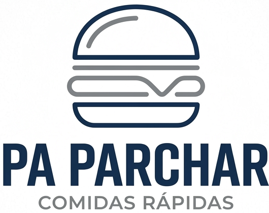

# Pa Parchar — Sistema de Gestión

<div align="center">



**Sistema web de gestión para restaurante de comidas rápidas**
**Manizales, Caldas — Colombia 🇨🇴**

[](https://developer.mozilla.org/es/docs/Web/HTML)
[](https://developer.mozilla.org/es/docs/Web/CSS)
[](https://developer.mozilla.org/es/docs/Web/JavaScript)
[](https://firebase.google.com)

</div>

---

## Descripción

**Pa Parchar** es una aplicación web de gestión empresarial desarrollada como parte del reto académico de toma de decisiones. Permite administrar ventas, inventario y finanzas de un restaurante de comidas rápidas, integrando conceptos del **Doing Business** (Banco Mundial) y el **Happiness Index** (ONU) en su análisis financiero.

> **Contexto académico:** Universidad de Caldas · Gestión Empresarial de TI 2 · 2026

---

## Funcionalidades

| Módulo | Descripción |
|---|---|
| 📊 **Dashboard** | Resumen general con KPIs del día, gráficas de ventas y alertas de stock |
| 🍽️ **Carta / Menú** | Gestión de productos con precios, categorías y búsqueda en tiempo real |
| 🛒 **Registrar Ventas** | Registro de ventas por producto con descuento automático del inventario |
| 📦 **Inventario** | Control de stock con alertas de ingredientes bajos y reposición automática |
| 💰 **Finanzas** | Módulo financiero completo con gráficas, análisis avanzado, punto de equilibrio y venta promedio por cliente |

---

## Tecnologías

| Tecnología | Versión | Uso |
|---|---|---|
| HTML5 | W3C Living Standard | Estructura de páginas |
| CSS3 | W3C Living Standard | Estilos y diseño responsivo |
| JavaScript | ES2020+ | Lógica de la aplicación |
| Firebase SDK | 12.13.0 | Base de datos en la nube (Firestore) |
| Chart.js | 4.4.1 | Gráficas e indicadores visuales |
| Google Fonts | API v2 | Tipografías Outfit y DM Mono |

**Entorno de desarrollo:**
- Visual Studio Code 1.122.1
- Node.js 22.22.1
- Google Chrome 148.0
- Windows 11 x64

---

## Estructura del Proyecto

```
pa-parchar/
│
├── index.html          # Dashboard principal
├── carta.html          # Menú y productos
├── ventas.html         # Registro de ventas
├── inventario.html     # Control de stock
├── finanzas.html       # Módulo financiero
├── seed-data.html      # Carga de datos demo (solo para desarrollo)
│
├── css/
│   └── styles.css      # Estilos globales — paleta azul/blanco
│
├── js/
│   ├── firebase.js     # Configuración y conexión a Firebase
│   ├── datos.js        # Datos base: productos, recetas, inventario
│   └── utils.js        # Funciones compartidas entre páginas
│
└── assets/
    └── logo.png        # Logo oficial Pa Parchar
```

---

## Base de Datos (Firebase Firestore)

El proyecto usa **Cloud Firestore** con las siguientes colecciones:

```
Firestore
├── Productos        → Menú del restaurante (12 productos)
├── ventas           → Historial de ventas registradas
├── inventario       → Stock de ingredientes (20 items)
├── movimientos      → Ingresos y gastos financieros
└── resumenDiario    → Consolidados por día
```

---

## Cómo ejecutar localmente

### Requisitos
- [Visual Studio Code](https://code.visualstudio.com/) con extensión **Live Server**
- Conexión a internet (para Firebase y fuentes)

### Pasos

```bash
# 1. Clonar o descargar el repositorio
git clone https://github.com/tuusuario/pa-parchar.git

# 2. Abrir la carpeta en VS Code
code pa-parchar

# 3. Clic derecho en index.html → "Open with Live Server"
```

La app abre en `http://127.0.0.1:5500/index.html`

> **Primera carga:** tarda 30-60 segundos mientras carga los datos históricos demo a Firebase.
> Las cargas siguientes son inmediatas.

---

## Datos incluidos

Al abrir la app por primera vez se cargan automáticamente **6 meses de datos históricos** con patrones reales:

| Mes | Característica |
|---|---|
| Diciembre 2025 | 🎄 Temporada navideña — ventas altas |
| Enero 2026 | 🎉 **Feria de Manizales** — pico máximo |
| Febrero 2026 | 📉 Post-feria — caída brusca |
| Marzo — Mayo 2026 | 📊 Operación normal con recuperación gradual |

---

## 🔗 Sitio web en vivo

👉 **[Ver sitio web en vivo](https://diegogarciadev8266.github.io/Pa-Parchar/)**

---

## Autores

| Nombre | Rol |
|---|---|
| **Bryan Steven Salinas Mahecha** | Desarrollo y documentación |
| **Diego Felipe Garcia Giraldo** | Desarrollo y documentación |

**Institución:** Universidad de Caldas  
**Asignatura:** Gestión Empresarial de TI 2  
**Año:** 2026

---

## 📄 Licencia

Proyecto académico — Universidad de Caldas © 2026
